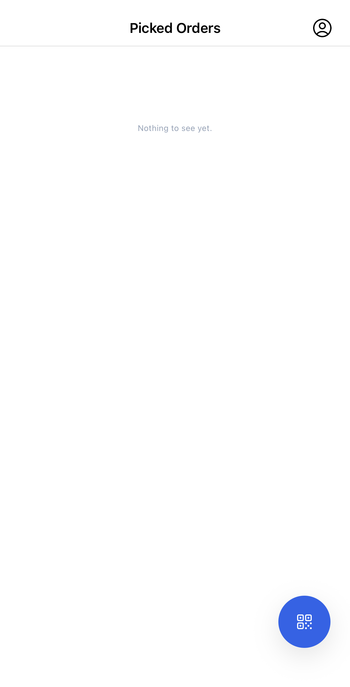

## Scan packages

Packages for Nuanom shops have QR codes on their labels which can be scanned to bring up the package's order information.

The QR code button at the bottom right of the app's home screen opens the scan dialog, which uses the phone's camera.
When launched for the first time, the carrier will have to grant the Nuanom Carrier app access to the camera.

## Confirm Pickup

When picking up packages, the carrier should scan all packages to add them to their list in the app. That way, when making deliveries, they will have an accurate log of all orders assigned to themselves.

An optional image and note can be added when confirming pickups.

## Confirm Delivery

When delivering packages, the carrier should confirm delivery of each package. Once delivery is confirmed, the item is removed from their list.

If there is extra information to be provided, the carrier can add an image or note when confirming delivery. This is especially useful for delivery slips with bus information that is typically provided for packages leaving a region (e.g., packages shipped out via bus to other regions).
