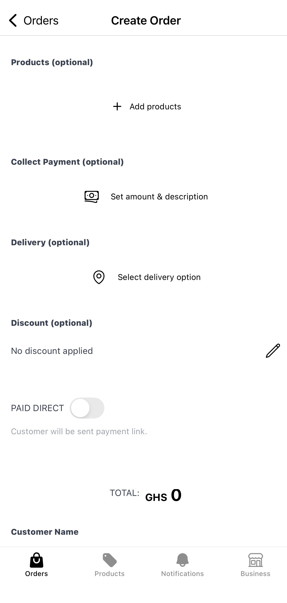
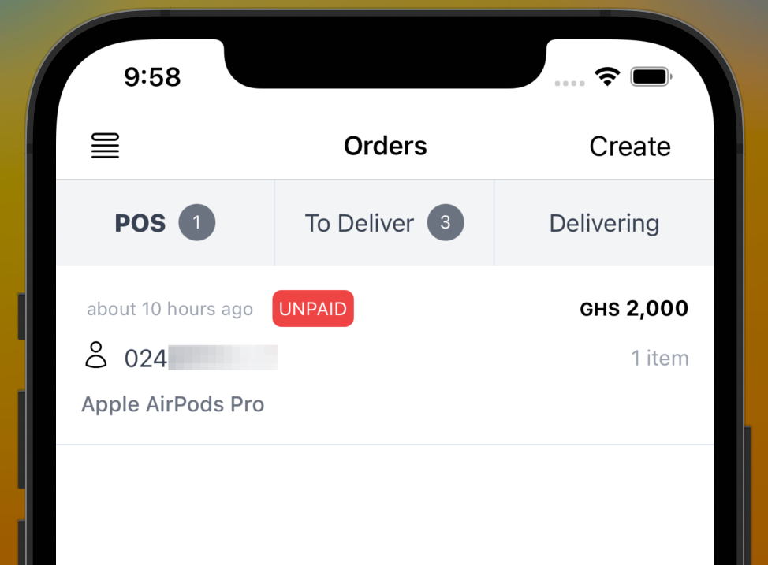

Nuanom allows you to easily receive orders via your website or mobile apps. However, you can also use Nuanom as a POS to record orders and take payments in person or via WhatsApp. 
There is also a dedicated Nuanom POS app for sales assistants. See [managing POS devices](/guides/merchant/manage-pos-devices/).

To do this, you create orders for your customers. Nuanom sends an SMS/email to the customer with a link.

Go to ***Orders > + Create Order***. 

Use the 'Add products' button to add products to the order.

You can also use the 'Collect payment' option instead of adding products to the order. This is useful when a product hasn't been uploaded yet and you need a quick way to collect or record a payment.

Set the delivery option if necessary. A quote will be generated. Share this with your customer. Once the customer acknowledges, add the customer's details and create the order.

For payments that will not be handled by Nuanom, you can toggle __PAID DIRECT__ on. When this is done the customer will just be sent a link with a receipt and the order will be marked COMPLETED.

Leaving __PAID DIRECT__ off will send the customer a link for payment. Once payment has been made you will get a notification and the order will be marked as COMPLETED.

A receipt is automatically generated and sent to the customer if there is no delivery option selected. If a delivery option is selected, the order will be marked as NEW and moved to the __To Deliver__ section for further processing.

