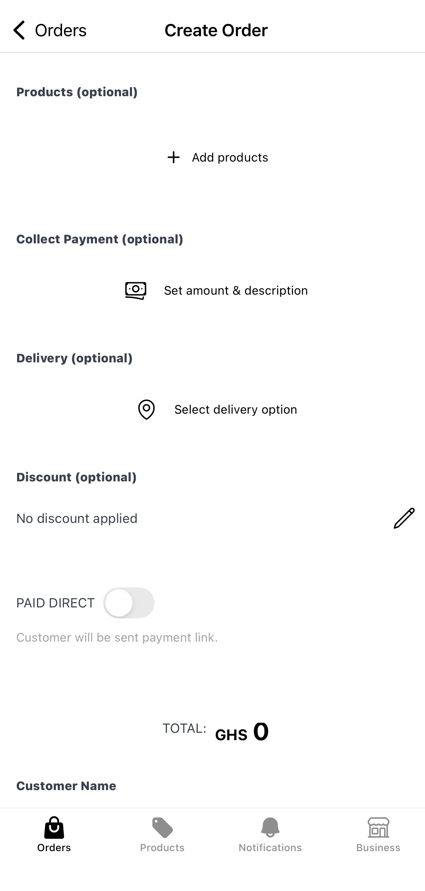
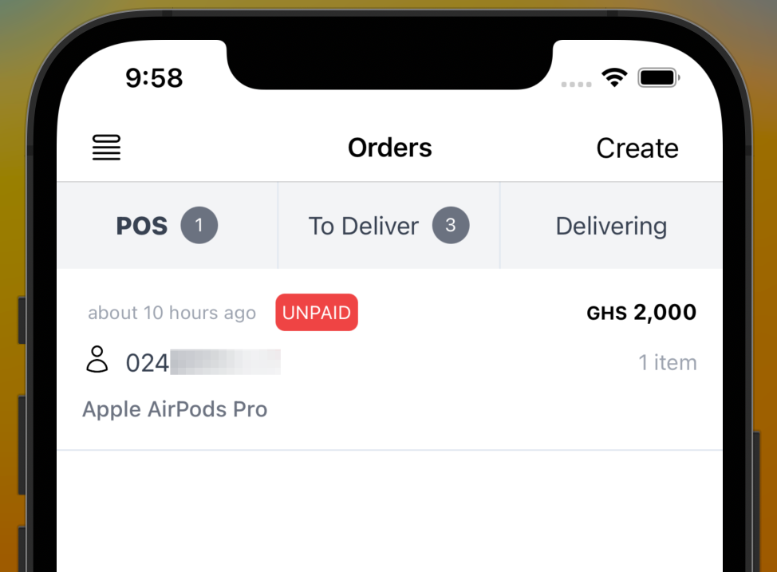

Nuanom allows you to easily receive orders via your website or mobile apps. However, you can also use Nuanom as a POS to record orders and take payments in person or via WhatsApp. 
There is also a dedicated Nuanom POS app for sales assistants. See [managing POS devices](/guides/merchant/manage-pos-devices/).

To do this, you create orders for your customers. Nuanom sends an SMS/email to the customer with a link.

There are four types of orders you will create with Nuanom.
1. In-store orders without payment. Meaning the customer pays cash or through another direct payment method.
2. In-store orders with required payment. The customer pays with payment link sent via SMS/email. The customer can also scan the QR code generated for the order to make payment.
3. Delivery orders without payment. Meaning the customer pays cash or through another direct payment method.
4. Delivery orders with required payment. The customer pays with payment link sent via SMS/email. The customer can also scan the QR code generated for the order to make payment.

Use the '+' button at the top right of the Orders tab to go to the create order screen.

Use the 'Add products' button to add products to the order. You can search or if you have SKU stickers on your products you can use the QR code scan button on the 'Add Products' screen to easily identify items and add them to the order. Nuanom sells printers and stickers specifically for tagging products in the shop. See 'External Links' section on the Business tab in the [Nuanom app](/guides/merchant) or contact [Nuanom support](https://nuanom.com/support) for more info.

You can also use the 'Collect payment' option instead of adding products to the order. This is useful when a product hasn't been uploaded yet and you need a quick way to collect or record a payment.

You can discount an order by an amount, if necessary. Use the 'Discount' option for that.

Set the delivery option if necessary. If a delivery option is selected, the order will be moved to the __To Deliver__ section for further processing. If not, it is moved to the __In Store__ section.

For payments that will not be handled by Nuanom, you can toggle __PAID DIRECT__ on. 

Leaving __PAID DIRECT__ off will send the customer a link for payment. Once payment has been made you will get a notification.

