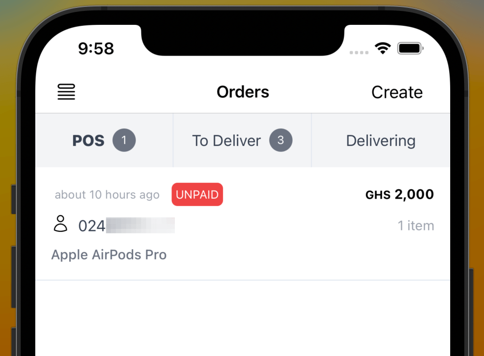

Nuanom allows you to easily receive orders online. However, you can also use Nuanom as a POS to take payments offline.

To do this you create orders for your customers. Nuanom sends an SMS/email to the customer to make payment.

Go to **Orders > + Create Order**. 

Use the 'Add products' button to add products to the order.

You can also use the 'Collect payment' option instead of adding products to the order.

Set the delivery option if necessary. A quote will be generated. Share this with your customer. Once the customer acknowledges, add the customer's details and create the order.

The customer will receive an SMS/email they can use to make payment. Once payment has been made you will get a notification and the order will be marked as COMPLETED.

A receipt is automatically generated and sent to the customer.

