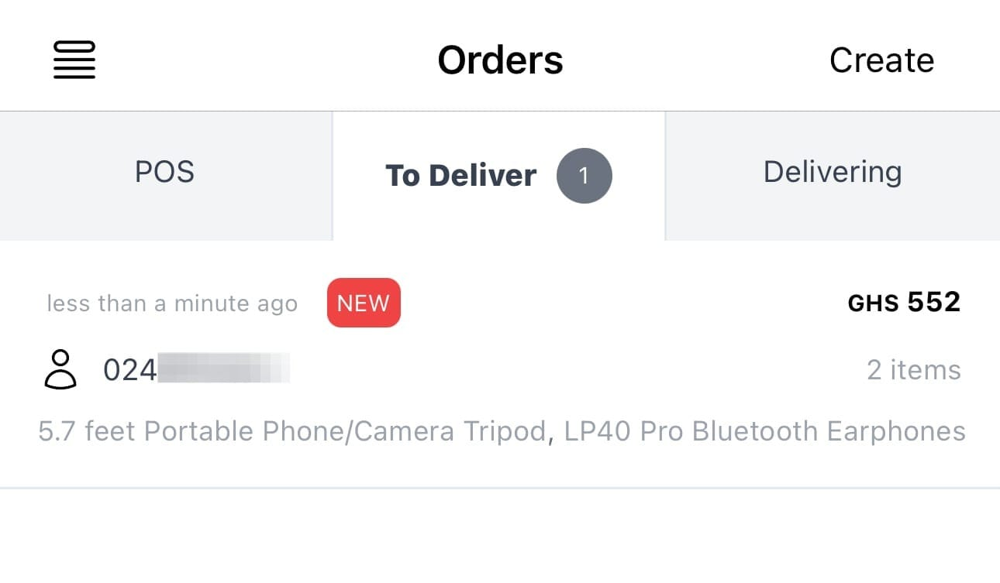

Nuanom allows you to create or receive orders in any and every way, online or offline. Even though we recommend you encourage your customers to make orders via your shop's website or shared product links there are some customers who might be hard to persuade. In such cases, Nuanom makes it easy to create orders for those customers.

On the Orders tab, tap the 'Create' button. Use the 'Add products' button to add products to the order. If the customer has already made payment for the products you can toggle the 'Exclude Products' switch ON.

Set the delivery option and you will instantly get an updated quote. Share this with your customer. Once the customer acknowledges, add the customer's details and create the order.

That's it! The order will show up in the 'To Deliver' section of the 'Orders' screen. Once the product(s) have been picked and delivered use the 'Confirm Pickup' and 'Confirm Delivery' actions to update the order and notify the customer.

Note: If you leave out the delivery option the order will be classified as an in-person order and will appear under the 'POS' tab.