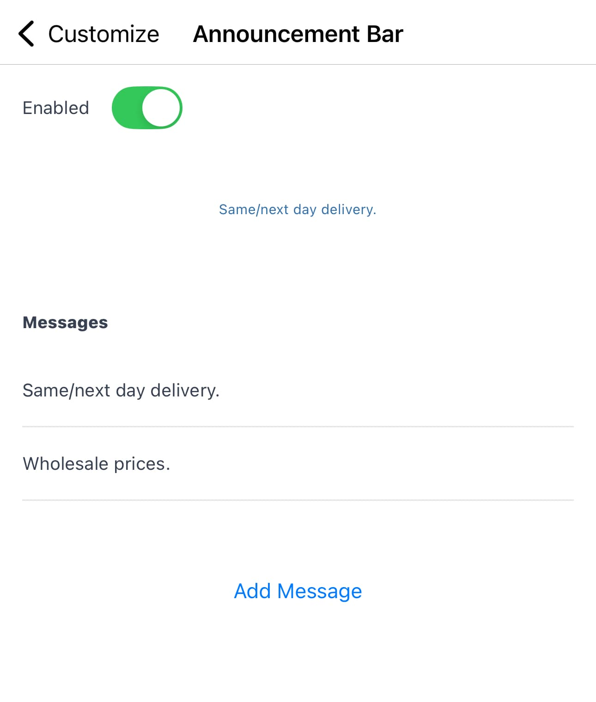

Nuanom allows you to make your shop unique. The following are the customizations you can make:

## Nav Bar

You can change the background and text colors of the navigation bar across your website and mobile apps.

Pick colors that match your brand's aesthetic. These colors are also used as the theme colors for your shop.

To change these colors, go to **Business > Customization > Nav Bar**. Hex codes can also be used to set specific colors.

## Announcement Bar

The announcement bar is displayed at the top of your website and mobile apps. Just below the nav bar. Its colors match the colors of the nav bar.

It is animated and can be used to display up to 3 short messages to your customers.

To update the announcement bar, go to **Business > Customization > Announcement Bar**.

Don't forget to toggle the switch to enable the announcement bar for it to be visible.

## Hero Banner

The hero banner is a large image displayed at the top of your website and mobile apps.

For best results, use a high resolution image with a wide aspect ratio.

Set a banner title that will be overlaid on the image. You can also add a link to the hero banner. By default this is a link to view all products.

To update the hero banner, go to **Business > Customization > Hero Banner**.

To see an example of the hero banner, visit [gadgets.nuanom.online](https://gadgets.nuanom.online/).
See how it adapts to various screen sizes across desktop, tablet and mobile.

Don't forget to toggle the switch to enable the hero banner for it to be visible.

