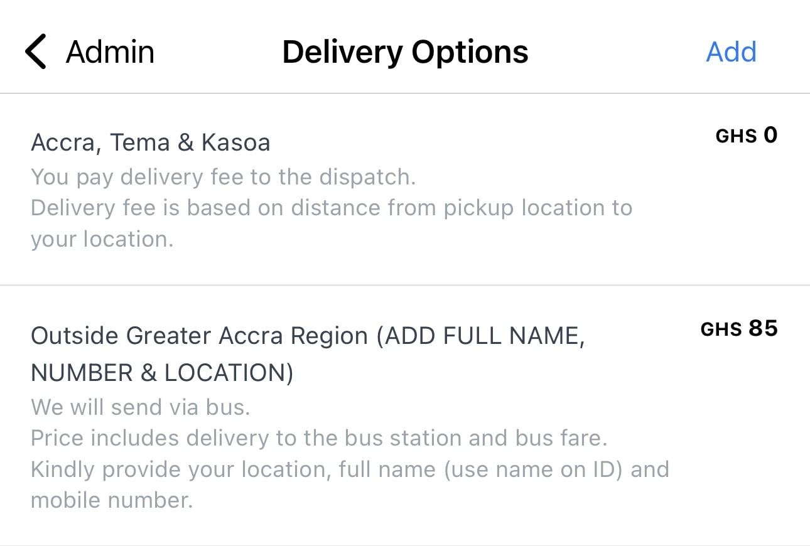

Delivery options are displayed on the checkout page to your customers.

Nuanom was developed in Accra, Ghana. The default delivery options are just meant as an example. 
You should modify these to suit your business.

You can add, remove and edit delivery options as needed.

Delivery options can be found under **Business > Admin > Delivery Options** .

Set prices for each delivery option. If there is no charge for a delivery option, set its price to 0.

