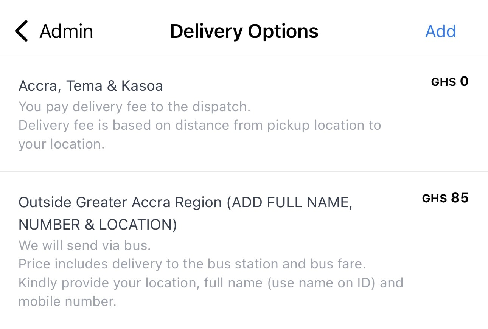

Delivery options are displayed on the checkout page to your customers.

The default delivery options are just meant as an example. Modify to suit your needs.

You can add, remove, and edit delivery options as needed, but you must have at least one delivery option.

In the Nuanom app, go to **Business > Settings > Delivery Options**.

Set prices for each delivery option. If there is no charge for a delivery option, set its price to 0.

