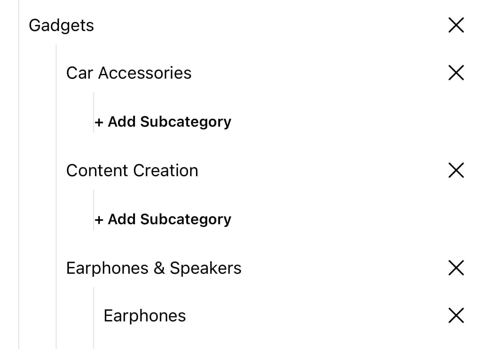
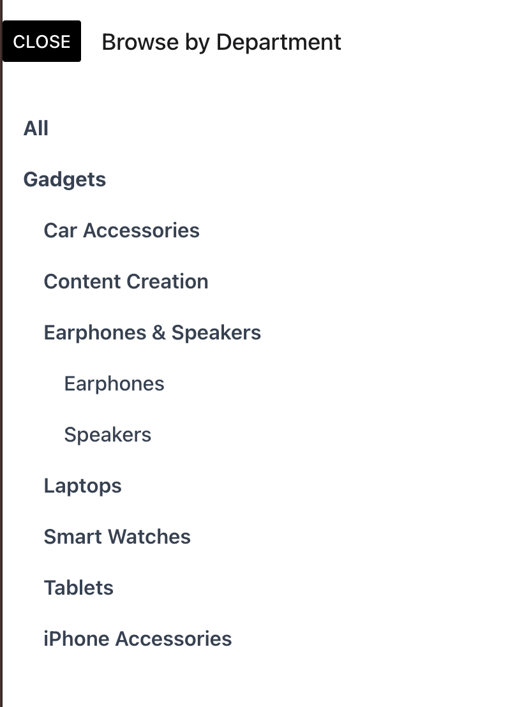

Nuanom provides a great way to organize your products in a nested hierarchy by Department > Category > Subcategory. 

On the products tab there is a dropdown filter at the top left. The last option in the dropdown will take you to the departments manager.

Tap 'Add Department' button to add a department. Once you add a department you will notice an 'Add Category' button show up underneath. Add a category and you will notice an 'Add Subcategory' button show up underneath the category. You can nest many categories under a department and many subcategories under a category.

Once you've added your departments and categories go to each product and update them to have a category or subcategory. Now you should be able to filter by departments and categories on your shop's homepage.

