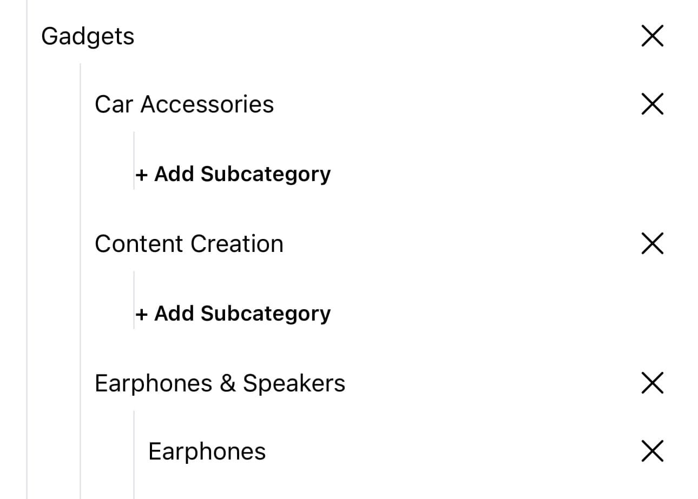
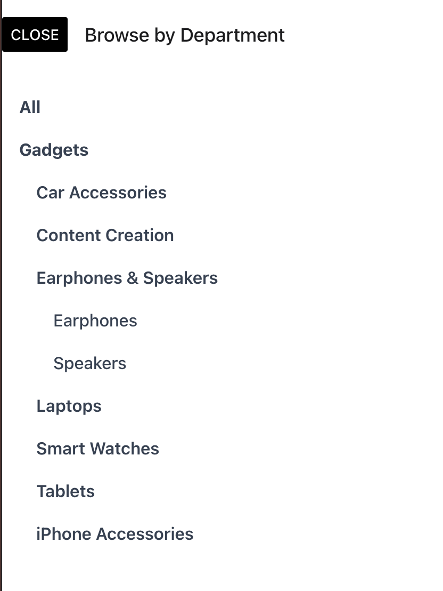

Nuanom provides a great way to organize your products in a nested hierarchy by Department > Category > Subcategory. 

On the **Products** tab there is a dropdown filter at the top left. The last option in the dropdown will take you to the departments manager.

Tap the **Add Department** button to add a department. Once added, an **Add Category** button will appear underneath it. Add a category and an **Add Subcategory** button will appear underneath that. You can nest many categories under a department and many subcategories under a category.

Once you've added your departments and categories, go to each product and update it to have a department, category, or subcategory. You should then be able to filter by departments and categories on your shop's homepage.

