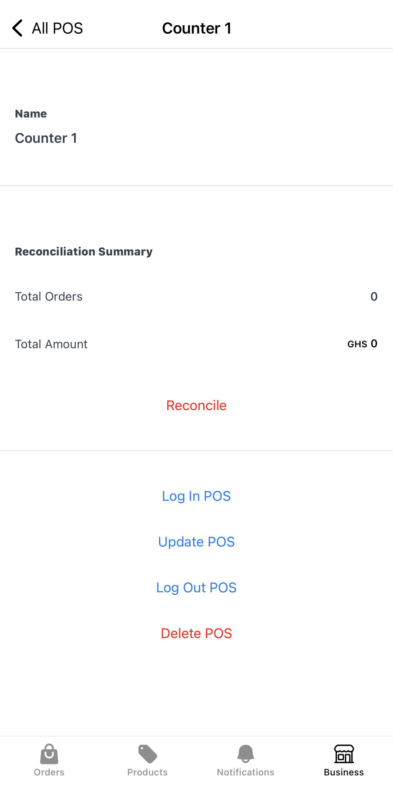

## Set up POS devices

Nuanom replaces bulky old-school POS devices with a simple app that can be set up for as many shop attendants as necessary.

Create an account for each POS device by going to ***Business > POS*** in the Nuanom app. You will be required to give the POS a name.
You can use generic names like 'Counter 1', 'Counter 2'... or use specific names for the individuals using the POS apps; 'Afia', 'Kofi'...

Shop attendants should download the __Nuanom POS__ app onto their devices. It is available on [Android](https://play.google.com/store/apps/details?id=com.nuanom.apps.pos) and [iOS](https://apps.apple.com/gh/app/nuanom-pos/id6754317027).

In the Nuanom app, go to ***Business > POS***, tap on the name of each device, and use the __Log In POS__ option to generate a code to log in to the Nuanom POS app. Repeat for all devices.

## Log out a POS device

At any time, you can log out a POS device from the Nuanom app by going to ***Business > POS***, selecting the device, and using the __Log Out POS__ option.

## Taking orders with the Nuanom POS app

Taking orders with the Nuanom POS app works exactly the same as creating orders with the Nuanom app. See [creating orders](/guides/merchant/create-orders/).

## Reconciling direct payments

When an order is made and the __PAID DIRECT__ option is used, Nuanom keeps the sum of orders made until the shop owner or manager reconciles the POS device.

Use the __Reconcile__ option on the POS screen in the Nuanom app to reset all direct payments back to 0. This is great for daily/periodic reconciliation of funds collected directly.

