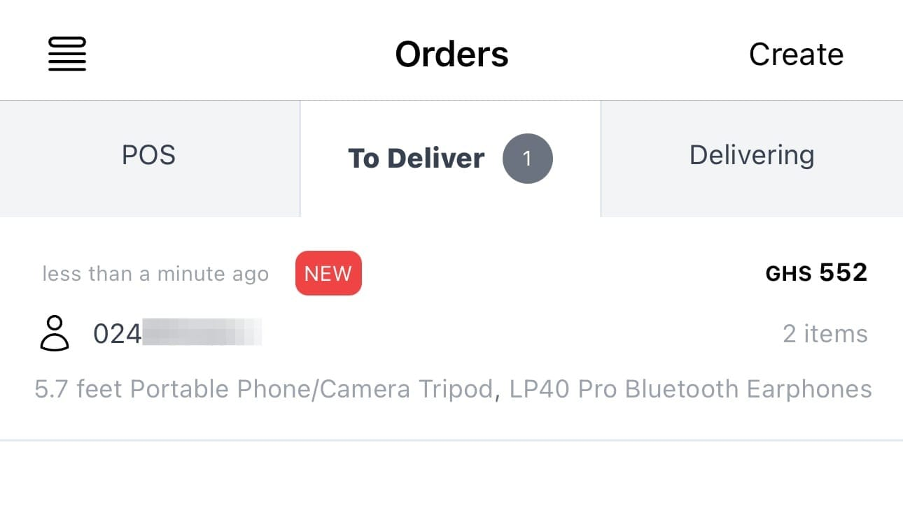

## Order lifecycle

Orders go through a number of stages:

1. **DRAFT/UNPAID**: The order is created, but the customer has not paid for it.
2. **NEW**: The customer has paid for the order.
3. **PROCESSING**: The order is in a batch for processing.
4. **COMPLETED**: The order has been packaged and dispatched/delivered. Customer receives receipt.
5. **CANCELED**: The order has been cancelled.

### DRAFT

When a customer uses your website or mobile apps to create an order, the order is initially in the DRAFT state prior to payment.

Customer has 3 hours to pay for the order. If payment is not made within this time, the order is automatically cancelled.

DRAFT orders do not appear in the Nuanom app.

### UNPAID

When you [manually create an order](/guides/merchant/create-orders/), the order is initially in the UNPAID state.

UNPAID orders appear in the Nuanom app under ***Orders > POS***.

Customer has 3 hours to pay for the order. If payment is not made within this time, the order is automatically cancelled.

### NEW

When customer pays for an order, the order is marked as NEW. The customer receives an SMS/email confirmation with a link to the order.

NEW orders appear in the Nuanom app under ***Orders > To Deliver***.

Customers can cancel NEW orders at any time.

### PROCESSING

To make it easier to process orders, you can create batches. A batch is a group of orders that you can process at the same time.
You can create a batch of up to 100 orders.

When you create a batch all orders in the batch are marked as PROCESSING. Packing slips are generated for all orders in the batch.

Customers cannot cancel PROCESSING orders, but you can cancel them by searching for the order based on user's mobile/email.

Orders in batches or PROCESSING do not appear under ***Orders > To Deliver***. 

### COMPLETED

An order can be marked as COMPLETED when it has been packaged and dispatched/delivered. You can complete orders individually or in batches.

Customers receive a receipt via SMS/email when an order is COMPLETED.

### CANCELED

Customers can cancel NEW orders at any time.

UNPAID or DRAFT orders are automatically canceled after 3 hours without payment.

## Batches

Batches are a way to process multiple orders at the same time.

You can create a batch of up to 100 orders.

Batches allow you to easily delegate the packaging and dispatching of orders.

Batches allow you to generate packing slips for multiple orders at the same time.

### Creating a batch

To create a batch, go to ***Orders > Batches > Create Batch***.

A batch of up to 100 orders will be created and packing slips will be generated for all orders in the batch.

These orders will be marked as PROCESSING and will be hidden from the ***Orders > To Deliver*** view.
The only way to see these orders is to view packing slips or search for orders individually.

You can cancel an order in a batch by searching for the order based on user's mobile/email.
When you cancel an order in a batch the packing slips are regenerated to reflect the change.

### Packing slips

A packing slips PDF document is generated for each batch.

You can view/download packing slips by selecting a batch from the ***Orders > Batches*** page.

### Complete orders in batches

When you are done packaging and dispatching all orders in a batch, you should complete the batch so that customers receive a receipt via SMS/email.

All orders in a batch are marked as COMPLETED when the batch is completed.

### Canceling all items in a batch

You cannot cancel all items in a batch. You can only cancel orders in a batch individually.

However, you can remove all items from a batch.

### Removing all items from a batch

You can remove all items in a batch and the items will be returned to the ***Orders > To Deliver*** view.

All orders in a batch are marked as NEW when the batch is removed.
