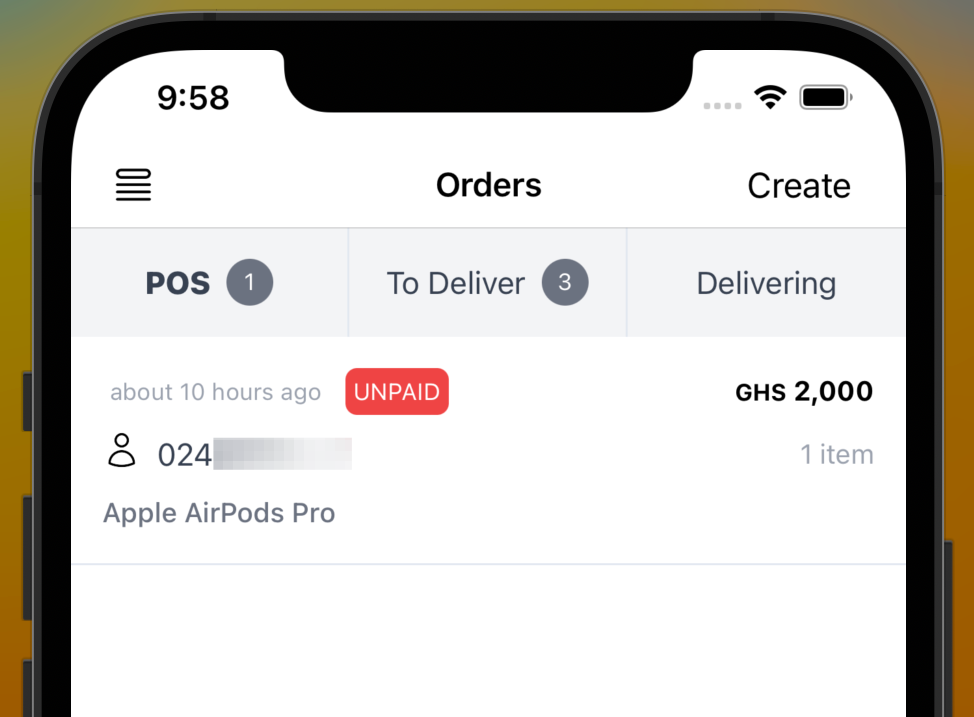

The Nuanom app is arguably the best mobile money POS. You can use Nuanom to take payments as well as issue invoices and receipts to your customers. It's super simple.

On the Orders tab, tap the 'Create' button. Use the 'Add products' button to add products to the order. If the customer has already made payment for the products you can toggle the 'PAID' switch ON.
This will exclude the products from the order total.

You can add delivery options if necessary, or even collect a cash payment.

Orders you create in the Nuanom app will be added to the POS orders section and marked as UNPAID. Once the order is paid you will get an alert and it will be marked as COMPLETED and moved to order history.

Yes, you can use Nuanom as a total POS replacement. In Ghana, most people don't use debit/credit cards so in most cases there is no need for bulky and expensive POS'.
Your smartphone is all you need.

Enjoy the magic!