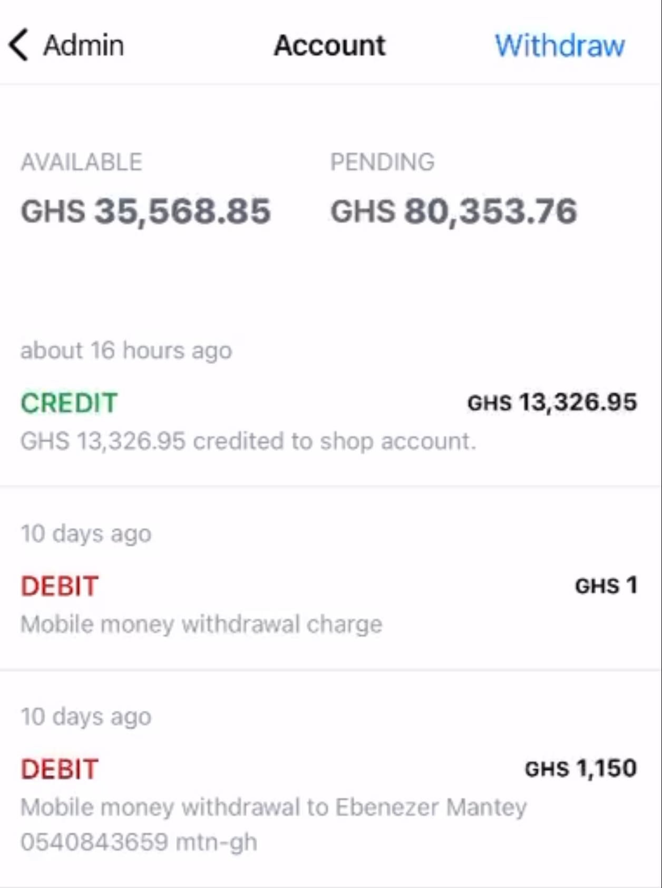

Nuanom settles merchants daily. You get all payments over a day old settled into your available balance every morning at 5am.

## Account balance

When you go to ***Business > Admin > Account*** you will see 2 balances:

- **AVAILABLE**: This is the amount of money you can withdraw.
- **PENDING**: This is the amount of money you have earned but has not settled.

## Withdraw money

To withdraw money, go to ***Business > Admin > Account*** and tap on the ***Withdraw*** button. You can withdraw to mobile money or bank account. 

Withdrawals can take up to an hour to process. You will receive a notification once your withdrawal is successful.
In the event of a failed withdrawal, you will receive a notification and the money will be returned to your available balance.

## Fees

Payments and withdrawals are subject to fees. See [pricing](https://nuanom.com/pricing) for more details.
