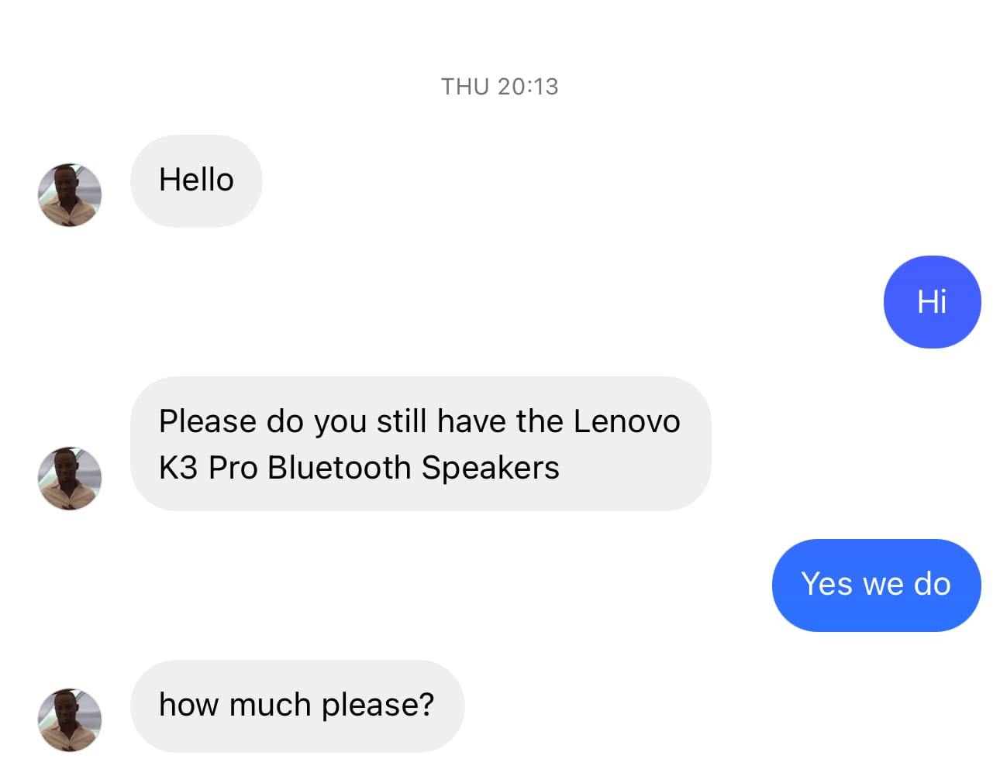
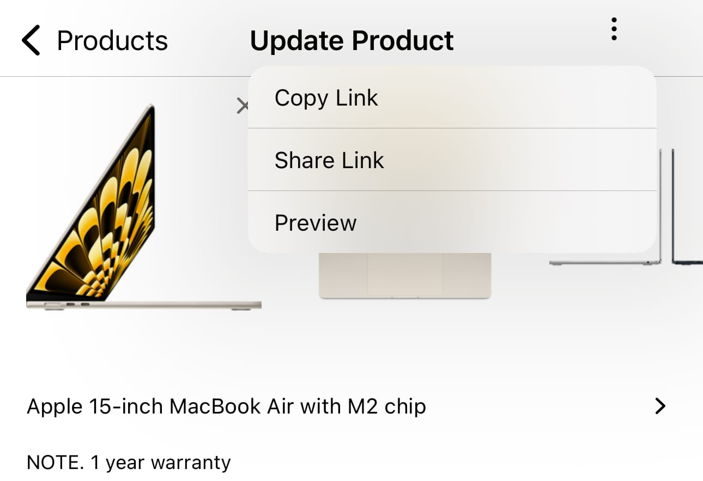

In Ghana, a lot of shops sell on social media platforms. Whether it's WhatsApp, TikTok, Instagram or Snapchat;
Nuanom helps you take these orders like a champ. Customers typically reach out via DMs to make inquiries or purchases. 
Nuanom is built for this. Be sure to [upload your products](/guides/merchant/upload-products/) to your shop before proceeding.

The Nuanom app makes it easy to share the links to your product listings with your customers. On each product's details screen, you will notice an options icon at the top-right. When tapped it shows a dropdown with sharing and preview options. Your can copy the link to the product listing or share directly to the app of your choice. You can also preview the product listing.

Your customers can easily order on your shop's website. Nuanom has the fastest checkout experience. Customers can pay instantly or on delivery with MoMo.

Sharing individual products is great for specific inquiries. However, you might want to share the link to your entire shop's storefront. This can be found on the Business tab. Tap the link under your shop's name to show similar sharing and preview options as seen on product listings.

You should always encourage your customers to use your online shop to make orders. However, there are scenarios where it is more convenient to make the order for the customer. See Creating orders for customers.