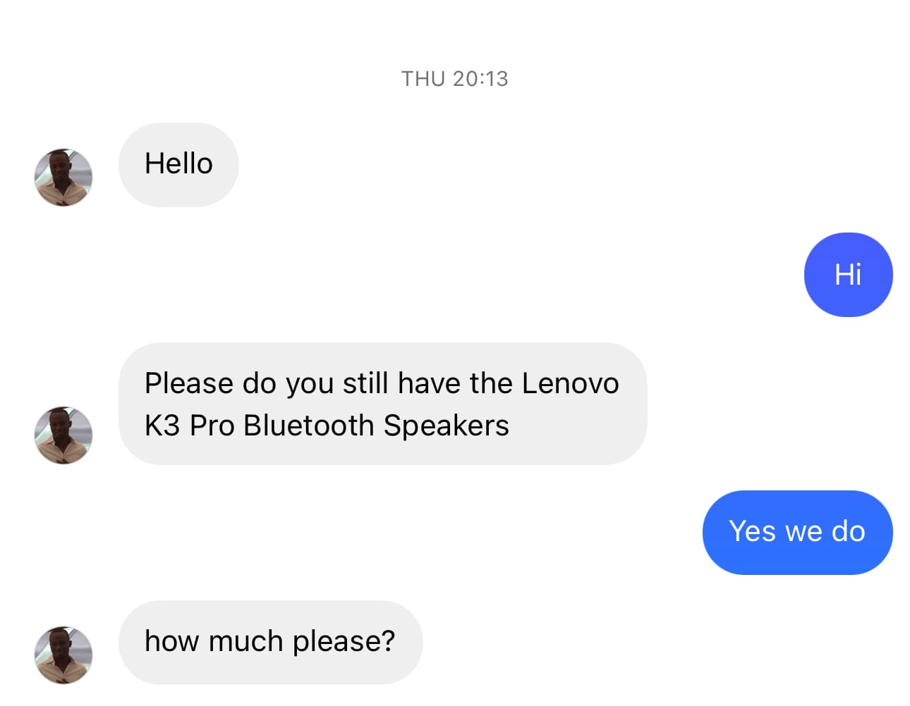

Customers sometimes reach out via DMs to make inquiries or purchases. 

The Nuanom app makes it easy to share the links to your product listings with your customers. 

At the top right of the product details screen, there is an options icon you can use to copy, share, or preview the product listing.

Sharing individual product links is a great way to easily answer product inquiries. 

However, you might want to share the link to your entire shop's storefront. This can be found on the Business tab. Tap the link under your shop's name to show similar sharing and preview options as seen on product listings.
