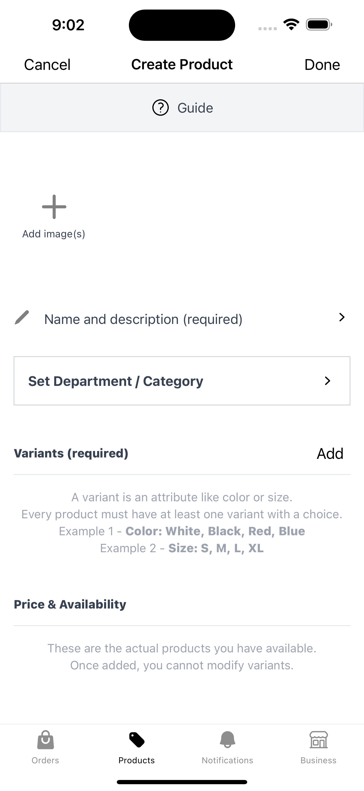
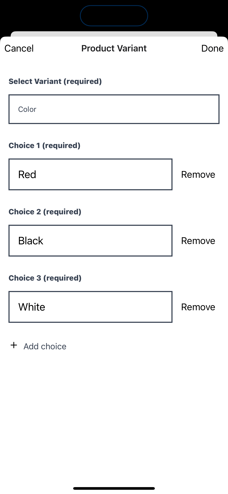
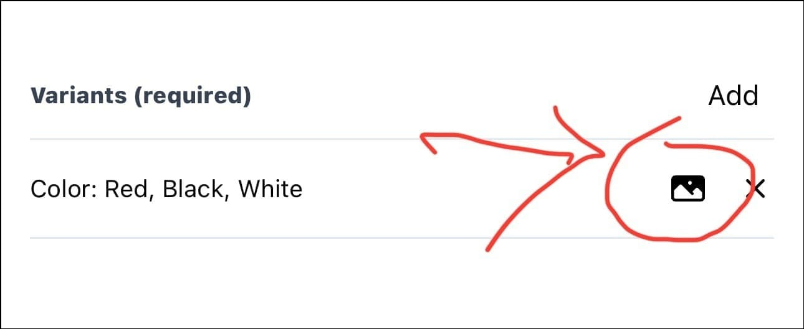
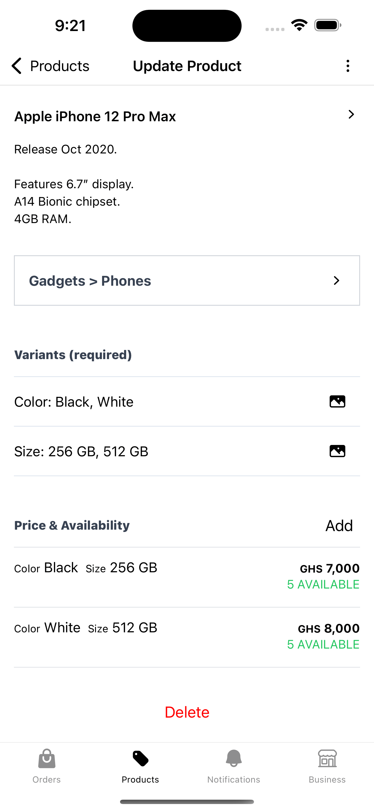

Nuanom is designed to be the simplest way to manage your shop in Ghana. It does not matter whether you sell online or offline. However, to get the best out of Nuanom the first steps is to upload your products.

## Images

First, you need your product's images. Investing a little time to make sure you have presentable images will improve the beauty of your listings. If your product comes in some kind of color variations you could also have images for each variation. Up to 10 images are supported.

In the Nuanom app, go the products tab, then tap the 'Create' button at the top-right to add a product. Add your images, then a name and description. Ignore 'Department/Category' for now, more on that later in this post.

## Variants

Now we need to add variants. Variants are the variations a product can have like color and size.
You need to add at least one variant. Each variant can have multiple choices.
Example a 'Color' variant can have multiple colors as choices. Add the necessary variants and choices for your product.

Next, we need to add the actual prices for the available product variants.
However, let's just save changes before we proceed. Tap the 'Done' button to create the product.
This will add the product, however without prices the product will be marked as out of stock.

Optionally, we can add images for each variant choice. This allows your customers to see
images for each variation when they switch the choice on the product listing. Tap the image icon to upload variant images.

## Price and availability

Add prices and quantities of the actual products you have in stock. Let's say you have a product with various color variations like red, black and white.
The red version of this product will have a separate price and quantity from the other colors. Add prices and quantities for all available variations of your product.

## Next steps

Great job! You have uploaded your product to Nuanom. You can now use the options button at the top-right
to share the link to your product with your customers via DMs or on social media. Your customers can use
the link to make orders which you will receive in the Nuanom app. You can also create orders manually for your customer using your uploaded products.

To further group your products you can see the guide on [Managing Departments & Categories](/guides/merchant/departments-categories/)

