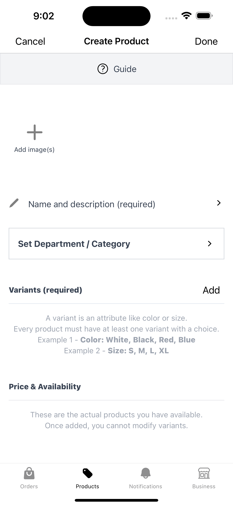
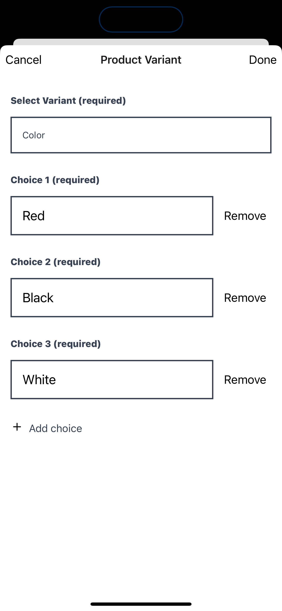
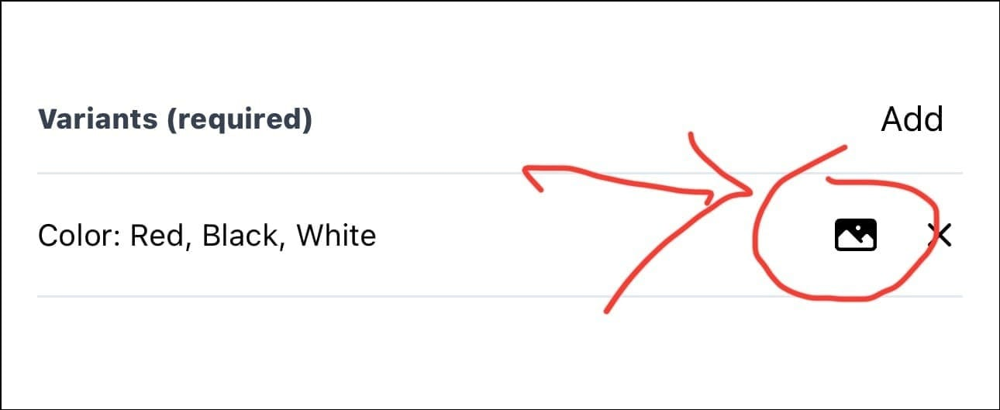
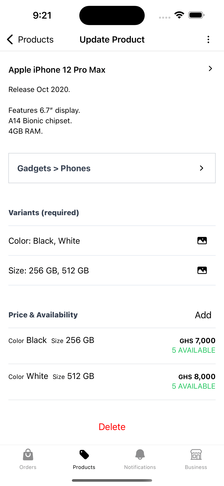
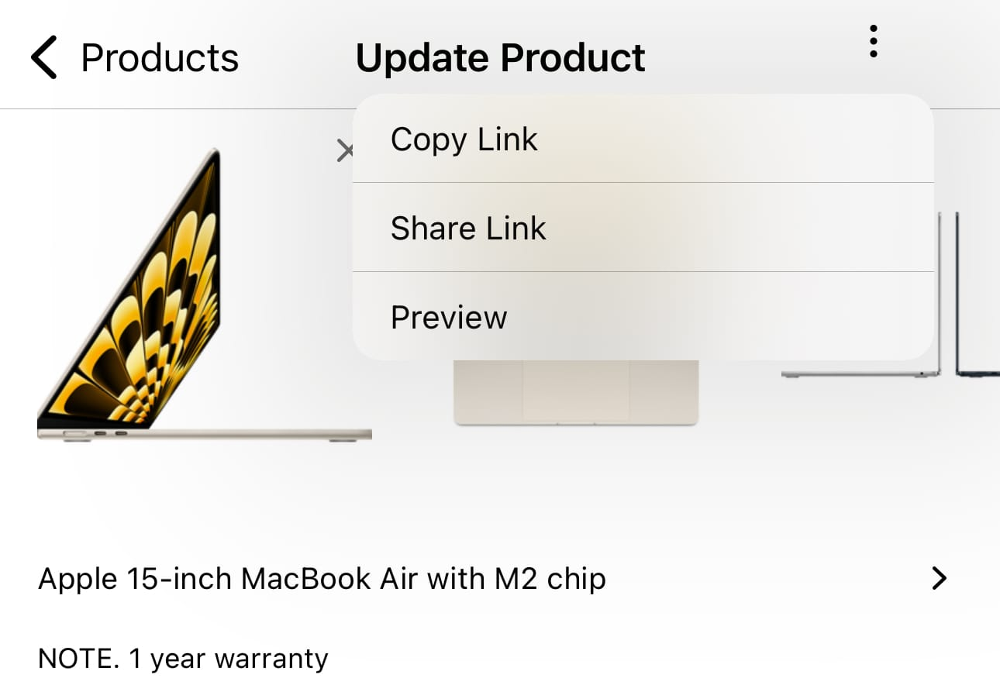

<iframe width="100%" style="aspect-ratio: 16/9;" src="https://www.youtube.com/embed/f0GGhBnnJHo" title="How to upload products to your shop" frameborder="0" allow="accelerometer; autoplay; clipboard-write; encrypted-media; gyroscope; picture-in-picture; web-share" allowfullscreen></iframe>

## Images

First, you need your product's images. Investing a little time to make sure you have presentable images will improve the beauty of your listings. 

If your product comes in some kind of color/size variations you could also add images for each variant. Up to 20 images are supported.

In the Nuanom app, go to the **Products** tab, then tap the '+' button at the top-right to add a product. 

Add your images. At least one image is required.

## Name & Description

After adding your image(s) tap on the pencil icon to add product name and description.

### AI generated names and descriptions

You can use the `Generate with AI` buttons to generate a name and description for your product.

The AI will generate a name and description based on the first image you added.

<video autoplay loop muted playsinline width="720" height="720">
  <source src="https://nuanom.com/assets/ai-descriptions_720p.mp4" type="video/mp4">
  Your browser does not support the video tag.
</video>

## Variants

Variants are the variations a product can have in color and/or size.

You need to add at least one variant. Each variant can have multiple choices.
For example, a 'Color' variant can have multiple colors as choices.

Add the necessary variants and choices for the product by tapping the ‘Add’ button at the top right of the ‘Variant’ section.

### Variant images

Optionally, we can add images for each variant choice. This allows your customers to see
images for each variation when they switch the choices. 

Tap the image icon to upload variant images. 

You need to add at least one image for each variant choice.

## Price and availability

Add prices and quantities of the actual products you have in stock. 

Let's say you have a product with various color variations like red, black and white.
The red version of this product will have a separate price and quantity from the other colors. 

Add prices and quantities for all available variations of your product by tapping the ‘Add’ button at the top right of the ‘Price & Availability’ section.

## Next steps

Great job! You have uploaded your product to Nuanom. You can now use the options button at the top-right
to share the link to your product with your customers via DMs or on social media. Your customers can use
the link to make orders which you will receive in the Nuanom app. You can also create orders manually for your customer using your uploaded products.

To further group your products you can see the guide on [Managing Departments & Categories](/guides/merchant/departments-categories/)

