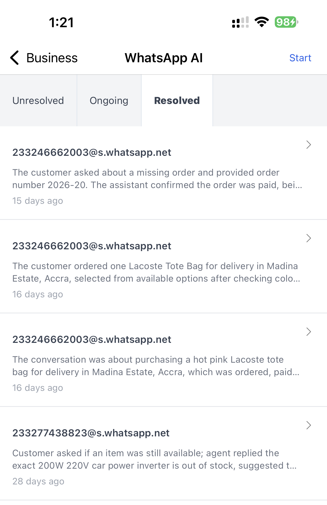

In Ghana, most customers still reach out via WhatsApp to make enquiries and place orders. This can be overwhelming to manage as your shop grows. Nuanom's WhatsApp AI Assistant solves this problem by taking over your WhatsApp and responding to customers on your behalf.

## Set up WhatsApp AI Assistant

1. Update your delivery options and about info (include delivery times, opening and closing times) so the assistant can respond accurately.
2. Add all your products to your shop so the assistant can take orders appropriately.
3. Get a WhatsApp number dedicated to your shop. Do not use a personal number — the assistant is not trained to respond to personal messages.
4. Go to ***Business > WhatsApp AI Assistant*** and tap the 'Start' button at the top right. It can take up to 2 minutes to create the assistant. You will get a notification when it is ready.
5. Once notified, go back to ***Business > WhatsApp AI Assistant*** and tap the 'Login' button at the top right.
6. Follow the instructions to link your dedicated WhatsApp number. You are all set!

## Conversations

On the WhatsApp AI Assistant screen in ***Business > WhatsApp AI Assistant*** there are three sections for conversations: Unresolved, Ongoing, and Resolved.

### Unresolved conversations

The AI assistant will respond to enquiries and take orders without needing your input. However, if something comes up that it cannot resolve by itself, it will send you an alert and place that conversation in the 'Unresolved' section for you to attend to.

Open the conversation and you will see a summary as well as the full conversation thread. Use the 'Resolve' button at the top right of the conversation screen to tell the AI how you want it to respond. The conversation will then be moved to the 'Ongoing' section for further processing.

### Ongoing conversations

All active conversations show up here. You do not need to attend to these conversations — it's just a simple way to see what the AI is up to. You can also open your WhatsApp app to view conversations directly.

### Resolved conversations

When a conversation is inactive for a certain period and the AI determines the customer's needs have been taken care of, it will mark that conversation as resolved and move it to the 'Resolved' section.

