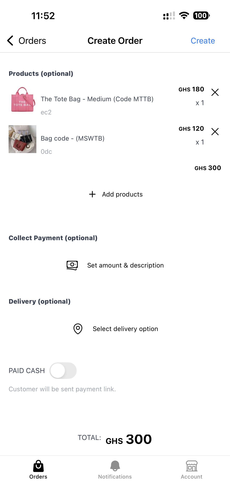

Use Nuanom POS to record orders and take payments in person or via WhatsApp. 

To do this, you create orders for your customers. Nuanom sends an SMS/email to the customer with a link. Each order also has a QR code that can be used to open the order link.

There are four types of orders you will create with the POS.
1. In-store orders without payment. Meaning the customer pays cash or through another direct payment method. Nuanom just sends a receipt and completes the order immediately after it's created.
2. In-store orders with required payment. The customer pays with payment link sent via SMS/email. The customer can also scan the QR code generated for the order to make payment. After payment the customer gets their receipt.
3. Delivery orders without payment. Meaning the customer pays cash or through another direct payment method. Nuanom just sends a link for the order. Order is marked as NEW for delivery processing.
4. Delivery orders with required payment. The customer pays with payment link sent via SMS/email. The customer can also scan the QR code generated for the order to make payment. After payment the order is marked as NEW for delivery processing.

Go to Orders tab and tap on the blue '+' button at the bottom right.

Use the 'Add products' button to add products to the order. You can search or if you have SKU stickers on your products you can use the QR code scan button on the 'Add Products' screen to easily identify items and add them to the order. Nuanom sells printers and stickers specifically for tagging products in the shop. See 'External Links' section on the Business tab in the [Nuanom app](/guides/merchant) or contact [Nuanom support](https://nuanom.com/support) for more info.

You can also use the 'Collect payment' option instead of adding products to the order. This is useful when a product hasn't been uploaded yet and you need a quick way to collect or record a payment.

You can discount an order by an amount, if necessary. Use the 'Discount' option for that.

Set the delivery option if necessary. If a delivery option is selected, the order will be marked as NEW and moved to the __To Deliver__ section for further processing.

For payments that will not be handled by Nuanom, you can toggle __PAID DIRECT__ on (__PAID CASH__ in order versions). When this is done the customer will just be sent a link with a receipt and the order will be marked COMPLETED.

Leaving __PAID DIRECT__ off will send the customer a link for payment. Once payment has been made you will get a notification and the order will be marked as COMPLETED.

