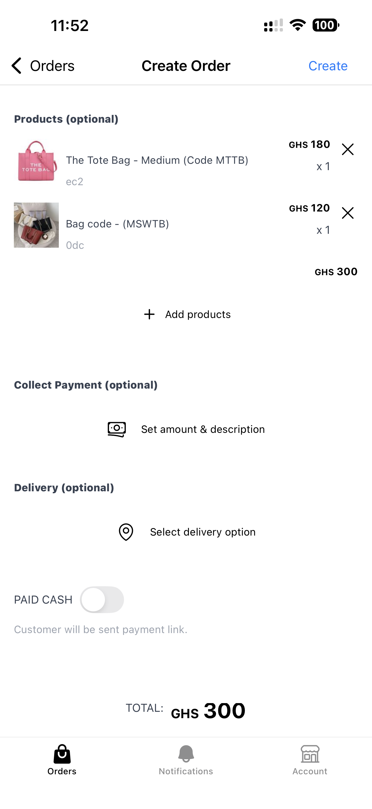

Use Nuanom POS to record orders and take payments in person or via WhatsApp.

Go to the Orders tab and tap the blue '+' button at the bottom right to create an order.

The rest of the order creation flow — order types, adding products, collecting payment, discounts, delivery, and payment options — is the same as in [Creating orders](/guides/merchant/create-orders/).
